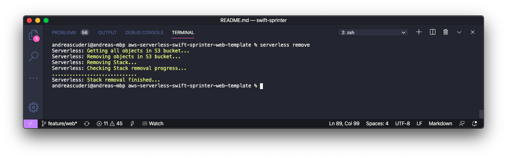

# AWS Serverless Swift-Sprinter Web Template

[](https://swift.org/download/) [](https://swift.org/download/)

This package demostrates how to write a Scalable HTML form server with the Serverless stack by using only Swift as development language.

## Hello Swift-Sprinter Web Example

The example is a very basic HTML web form styled with bootstrap and rendered by ```Swift```.


It doesn't contain any JavaScript as in this example I wanted to show that sometime is not needed 😁.

The form posts different ```application/x-www-form-urlencoded``` forms to perform basic CRUD actions.

## Serverless architecture

The architecture is based on the classical AWS Serverless stack: APIGateway, Lambda and DynamoDB.
- `APIGateway`: acts as a `proxy` for the `Lambda` and exposing it to the internet.
- `Lambda`: is the computational layer.
- `DynamoDB`: is the AWS `NoSQL` database

Advantages:
- Pay per use
- No fixed costs
- Auto-Scaling
- DevOps


## Application

The application uses [Swift-Sprinter](https://github.com/swift-sprinter/aws-lambda-swift-sprinter) as AWS Custom Lambda Runtime and acts as a presentation layer of the DynamoDB content via Web.


The actions send from the web form are converted to shows different pages.

The following frameworks are used:
- [aws-lambda-swift-sprinter-nio-plugin](https://github.com/swift-sprinter/aws-lambda-swift-sprinter-nio-plugin): Implements the AWS Custom Runtime usin Swift NIO.
- [aws-sdk-swift](https://github.com/swift-aws/aws-sdk-swift): Interacts with DynamoDB
- [Plot](https://github.com/JohnSundell/Plot): Renders the HTML
- [Boostrap](https://getbootstrap.com): CSS for HTML pages. (JavaScript - Disabled)

## Requirements

- Install [Docker](https://docs.docker.com/install/)
- Install [Serverless Framework](https://www.serverless.com/framework/docs/getting-started/)
- Ensure your AWS Account has the right [credentials](https://www.serverless.com/framework/docs/providers/aws/guide/credentials/) to deploy a Serverless stack.
- Clone this repository. From the command line type:

```console
git clone https://github.com/swift-sprinter/aws-serverless-swift-sprinter-web-template
cd aws-serverless-swift-sprinter-web-template
```
- Ensure you can run `make`:

```console
make --version
```

the `Makefile` was developed with this version:
```
GNU Make 3.81
Copyright (C) 2006  Free Software Foundation, Inc.
This is free software; see the source for copying conditions.
There is NO warranty; not even for MERCHANTABILITY or FITNESS FOR A
PARTICULAR PURPOSE.

This program built for i386-apple-darwin11.3.0
```

## Build

Use the following command to build the code before using the serverless commands:
```
./build.sh
```


## Deploy

Deploy the full solution to your AWS using Serverless:
```
./deploy.sh
```


After the deployment is completed, the URL of the website is provided by the Serverless framework.

## Update

Rebuild the code and update the Lambda to your AWS using Serverless:
```
./update.sh
```


## Remove

To remove the deployment use:
```
serverless remove
```

